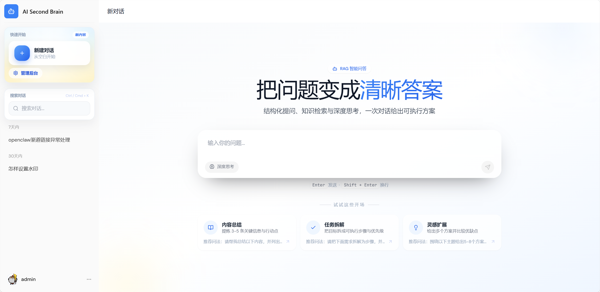

# AI Second Brain


AI Second Brain是一个企业级 Agentic RAG（Retrieval-Augmented Generation）平台，覆盖从文档入库到智能问答的完整链路。项目旨在解决企业知识管理中的信息孤岛问题，提供智能化的文档检索与问答能力。

---

## 项目预览



---

## 核心功能

- **智能问答**：基于企业知识库提供准确的 AI 问答服务
- **多路检索**：多渠道并行检索，兼顾精准与召回
- **意图识别**：树形多级分类，置信度不足时主动引导澄清
- **模型引擎**：模型调度、健康检查、自动降级，确保服务稳定性
---

## 技术栈


- Backend：FastAPI、SQLAlchemy 2.x async、Alembic、Pydantic Settings
- Metadata DB：PostgreSQL 16
- Cache / progress / future queue：Redis
- Vector DB：Qdrant（开发/测试环境在 Qdrant 不可用时可使用进程内 fallback，生产必须使用 Qdrant）
- Storage：本地文件系统（开发默认），后续兼容 MinIO/S3
- Frontend：Next.js App Router、TypeScript、Tailwind CSS、Zustand
- Streaming：SSE，事件顺序为 `chunk* -> citation? -> done`


---

## 系统架构

```text
用户浏览器
    │
    │  REST API / 文件上传
    ▼
Next.js Web UI
    │
    │  REST API
    ▼
FastAPI Backend（/api/v1）
    │
    ├── Auth & Scope
    │     └── JWT / global-folder-file 范围问答
    │
    ├── Ingestion Service
    │     ├── 上传 / 分片 / 任务进度
    │     ├── DeepDoc 解析 TXT / PDF / Word
    │     ├── 清洗 / 分块 / locator 保留
    │     ├── PostgreSQL：users / files / chunks / tasks
    │     ├── Qdrant：chunk embeddings
    │     ├── Redis：cache / progress
    │     └── Local Storage / MinIO：原始文件
    │
    └── RAG Agent Workflow
          ├── retrieve：Hybrid Retriever（Vector + BM25 + Rerank）
          │     ├── PostgreSQL：元数据与 chunk 回查
          │     ├── Qdrant：向量召回
          │     └── Redis：缓存 / 降级辅助
          ├── generate：OpenAI-compatible LLM
          ├── validate：Citation Validator（逐句引用校验 / 降级）
          └── emit：SSE chunk* -> citation? -> done
                    │
                    ▼
              Next.js Web UI 实时渲染回答与引用
```

## 用户问答流程

```
用户提问
    │
    ▼
┌─────────────────┐
│  1. 问题重写     │  ← 补全多轮对话上下文
│  (Query Rewrite)│
└─────────────────┘
    │
    ▼
┌─────────────────┐
│  2. 意图识别     │  ← 树形多级分类
│  (Intent Classify)│
└─────────────────┘
    │
    ├── 置信度不足 → 引导澄清
    │
    ▼
┌─────────────────┐
│  3. 多路检索     │  ← 并行执行多个检索通道
│  (Multi-Channel Retrieval)│
└─────────────────┘
    │
    ▼
┌─────────────────┐
│  4. 后处理       │  ← 去重 → Rerank
│  (Post-Process) │
└─────────────────┘
    │
    ▼
┌─────────────────┐
│  5. 上下文组装   │  ← 构建 Prompt
│  (Context Build)│
└─────────────────┘
    │
    ▼
┌─────────────────┐
│  6. 模型生成     │  ← 流式输出 SSE
│  (LLM Generate) │
└─────────────────┘
    │
    ▼
  返回答案
```

## 文档入库流程

```
文档上传
    │
    ▼
┌─────────────────┐
│  1. 获取文档     │  ← 文件上传
│  (Fetcher)      │
└─────────────────┘
    │
    ▼
┌─────────────────┐
│  2. 解析文档     │  ← Markdown 解析
│  (Parser)       │
└─────────────────┘
    │
    ▼
┌─────────────────┐
│  3. 分块处理     │  ← 固定大小 / 结构感知
│  (Chunker)      │
└─────────────────┘
    │
    ▼
┌─────────────────┐
│  4. 增强处理     │  ← 摘要生成 / 问答对生成
│  (Enhancer)     │
└─────────────────┘
    │
    ▼
┌─────────────────┐
│  5. 向量化       │  ← Embedding 模型
│  (Embedding)    │
└─────────────────┘
    │
    ▼
┌─────────────────┐
│  6. 索引存储     │  ← Qdrant
│  (Indexer)      │
└─────────────────┘
```


---

## 目录结构

```text
.
├─ backend/    # FastAPI 服务（/api/v1）
├─ frontend/   # Next.js Web UI
├─ docs/       # PRD / TDD / API / Database 等文档（单一事实来源）
└─ docker-compose.yml  # Docker 编排（依赖服务 + 前后端 full stack profile）
```

---

## 环境要求

- Node.js 18+（建议 20+）+ npm
- Python 3.11+
- uv
- Docker Desktop（用于一键启动依赖，或前后端 + 依赖整体部署）

端口默认占用：

- Frontend：`3000`
- Backend：`8000`
- Postgres：`5433`
- Redis：`6379`
- Qdrant：`6333`（HTTP）、`6334`（gRPC）
- MinIO：`9000`（S3 API）、`9001`（Console）

---

## 安装与启动（本地开发）

### 1) 配置环境变量

根目录复制一份环境变量文件：

```shell
copy .env.example .env
```

按需修改 `.env`（后端配置变量统一使用 `AISB_` 前缀）。最小可用配置见：

- `AISB_DATABASE_URL`（Postgres）
- `AISB_REDIS_URL`（Redis）
- `AISB_JWT_SECRET`（JWT 密钥）
- `AISB_STORAGE_DIR`（本地对象存储目录）

### 2) 使用 `make` 一键准备并启动

项目根目录提供了统一的 `Makefile`，推荐直接使用下面的命令完成本地开发启动：

```powershell
make setup
make dev
```

含义说明：

- `make setup`：启动依赖服务，并安装后端/前端依赖，最后执行后端数据库迁移
- `make dev`：同时启动后端 FastAPI 和前端 Next.js 开发服务

打开：

- 前端：`http://localhost:3000`
- 后端（API）：`http://localhost:9000/api/v1`

### 3) 常用 `make` 命令

```powershell
make up       # 启动 Postgres / Redis / Qdrant / MinIO
make down     # 停止 Docker 依赖服务
make logs     # 查看依赖服务日志
make backend-run # 只启动后端服务
make frontend-run # 只启动前端服务
``` 

## Docker 一键部署（前后端 + 依赖）

如果希望前后端也都运行在 Docker 中，可直接使用：

```powershell
make docker-up
```

常用命令：

```powershell
make docker-build  # 构建前后端镜像
make docker-up     # 构建并启动完整栈
make docker-ps     # 查看完整栈状态
make docker-logs   # 查看前后端容器日志
make docker-down   # 停止完整栈
```

启动后访问：

- 前端：`http://localhost:3000`
- 后端：`http://localhost:8000/api/v1`

---


## 常用开发命令

**后端**

```powershell
cd backend
uv sync --extra test
uv run pytest
```

**前端**

```powershell
cd frontend
npm run lint
npm run build
```

---
